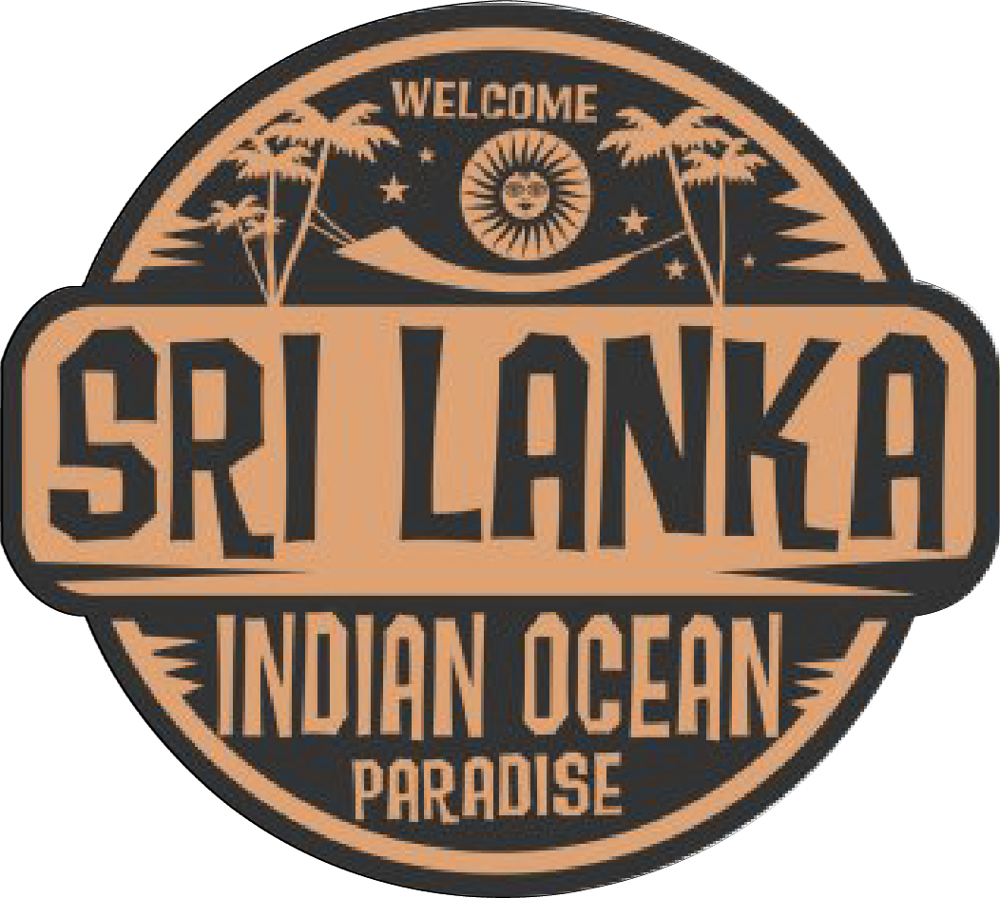

# Pearl of the Indian Ocean - Sri Lanka Tourism Website



> A modern, professional tourism website showcasing the beauty and attractions of Sri Lanka with interactive features, comprehensive destination database, and responsive design.

---

## 📋 Table of Contents

- [Overview](#overview)
- [Key Features](#key-features)
- [Technology Stack](#technology-stack)
- [Project Structure](#project-structure)
- [Installation & Setup](#installation--setup)
- [Pages & Descriptions](#pages--descriptions)
- [Database Structure](#database-structure)
- [Design System](#design-system)
- [Features in Detail](#features-in-detail)
- [Browser Compatibility](#browser-compatibility)
- [Credits](#credits)

---

## 🌟 Overview

**Pearl of the Indian Ocean** is a comprehensive tourism website dedicated to Sri Lanka, designed to provide travelers with detailed information about destinations, attractions, and travel planning tools. The website features a modern, elegant interface with interactive maps, extensive destination database, and a responsive design that works seamlessly across all devices.

**Status:** ✅ 100% Complete & Production Ready

---

## 🎯 Key Features

### 🏠 Home Page
- **Auto-Rotating Hero Slider** - 6 stunning background images with 5-second intervals
- **Advanced Search Bar** - Real-time search with 6 destination suggestions dropdown
- **Feature Grid** - 4-column showcase of Sri Lanka's premier attractions
- **Image Gallery Slider** - Rotating gallery of destination highlights
- **Call-to-Action Buttons** - Strategic prompts for user engagement
- **Newsletter Signup** - Email subscription for travel updates

### 📍 Information Page
- **Interactive Google Maps** - Embedded map showing Sri Lanka's geography
- **Tabbed Navigation** - 5 sections (Geography, History, Culture, People, Provinces)
- **Province Cards** - All 9 provinces with capital, population, area, and attractions
- **27 Destination Locations** - Complete information for major travel destinations
- **Synchronized Footer Navigation** - Links in footer sync with section tabs
- **Touch-Friendly Interface** - Optimized for all devices

### ✒️ Travel Planner (Todo List)
- **Vue.js 3 Application** - Modern reactive framework for task management
- **Task Categories** - Organize trips by categories (Hotels, Flights, Activities, Food, etc.)
- **LocalStorage Persistence** - Tasks saved to browser storage (no server needed)
- **Add/Complete/Delete Tasks** - Full CRUD operations
- **Task Filtering** - View all tasks or by category
- **Date Support** - Track task dates with formatted display
- **Emoji Category Icons** - Visual category identification

### 📞 Contact Us Page
- **Contact Form** - Name, email, message input fields
- **Business Information** - Office address and operating hours
- **Multi-channel Contact** - Phone, email, and social media links
- **Map Integration** - Location visualization

### ℹ️ About Us Page
- **Company Mission & Vision** - Core values and objectives
- **Team Information** - Company details and background
- **Professional Branding** - HiruNova-X attribution

### 🔍 Search Results Page
- **Destination Details** - Complete information for selected location
- **Dynamic Province Display** - Shows which province the destination belongs to
- **Category & Type** - Quick reference for destination classification
- **Attractions List** - Key attractions and activities available
- **Photo Gallery** - 6-image responsive grid with hover effects
- **Interactive Lightbox** - Full-screen image viewer with keyboard navigation
- **Back Navigation** - Quick return to home page

### 🗄️ Database Features
- **27 Destinations** - Across 9 provinces
- **81 High-Quality Images** - 3 photos per destination
- **Structured JSON** - Easy-to-parse destination data
- **Attraction Tags** - Categorized attractions per destination
- **Search Optimization** - Fast real-time destination search

---

## 🛠️ Technology Stack

### Frontend
- **HTML5** - Semantic markup structure
- **CSS3** - Modern styling with animations, gradients, and flexbox/grid
- **JavaScript (ES6+)** - Interactive functionality and DOM manipulation
- **Vue.js 3** - Reactive framework for Todo List application

### Libraries & APIs
- **Font Awesome 6.4.0** - 48+ professional tourism icons
- **Google Fonts API** - Playfair Display (serif) & Poppins (sans-serif)
- **Google Maps Embed API** - Interactive geographic visualization
- **Bootstrap 3.3.7** - Utility framework (minimal usage)

### Design & UX
- **Responsive Design** - Mobile-first approach
- **CSS Animations** - Gradient shifts, fade-ins, and transitions
- **Flexbox & CSS Grid** - Modern layout techniques
- **CSS Variables** - Dynamic theming and maintenance

### Browsers Supported
- Chrome/Chromium (latest 2 versions)
- Firefox (latest 2 versions)
- Safari (latest 2 versions)
- Edge (latest 2 versions)
- Mobile browsers (iOS Safari, Chrome Mobile)

---

## 📁 Project Structure

```
Tourism Website Mini Project/
├── index.html                       # Landing page with hero slider
├── styles.css                       # Main stylesheet (980 lines)
├── footer.css                        # Standardized footer styles
├── logo.png                          # Brand logo
├── train.jpg, img2-6.jpg            # Hero background images
│
├── information/
│   ├── Information.html              # Information hub with 5 tabs
│   ├── style-info.css                # Information page styles
│   ├── info.js                       # Tab navigation & sync logic
│   └── about/
│       ├── about.html                # More details if needed
│       └── style-about.css
│
├── ToDoList/
│   ├── ToDo List.html                # Vue.js travel planner
│   └── ToDoList.css                  # Todo styling
│
├── Contact Us/
│   ├── contactus.html                # Contact form & info
│   └── contactus.css                 # Contact page styles
│
├── About/
│   ├── About Us.html                 # Company info
│   └── About Us.css                  # About page styles
│
├── search.css                        # Search bar styling
├── search-results.html               # Destination results page
├── sri-lanka-database.json           # Destination database (27 locations)
│
└── README.md                         # This file
```

---

## 🚀 Installation & Setup

### Prerequisites
- Modern web browser (Chrome, Firefox, Safari, or Edge)
- Text editor (VS Code recommended)
- No server required - runs entirely in browser

### Quick Start

1. **Clone or Download** the project repository
   ```bash
   git clone https://github.com/isuranga-lahiru/Tourism-Website-mini-project.git
   ```

2. **Navigate to project directory**
   ```bash
   cd "Tourism Website Mini Project"
   ```

3. **Open in browser** (one of the following methods)
   - Double-click `index.html`
   - Right-click → Open with → Browser
   - Use VS Code Live Server extension
   - Deploy to web server (optional)

4. **No additional setup needed** - All features work out of the box!

### For Live Development
```bash
# Using VS Code Live Server
1. Install "Live Server" extension
2. Right-click index.html
3. Select "Open with Live Server"
4. Browser opens to http://localhost:5500
```

---

## 📄 Pages & Descriptions

### 1. Home Page (`index.html`)
**Purpose:** Primary landing page and entry point  
**Key Sections:**
- Sticky header with navigation
- Hero section with auto-rotating image slider (6 images, 5-second intervals)
- Search bar with destination suggestions (max 6)
- About section with 4-column feature grid
- Gallery slider showcasing destinations
- Newsletter signup section
- 4-column standardized footer

**Navigation:** Home → Information, Travel Plan, Contact, About  
**Special Features:** Search functionality triggers navigation to `search-results.html`

**Responsive Breakpoints:**
- Desktop (1200px+): Full layout with all elements
- Tablet (768px): Single column for features, adjusted fonts
- Mobile (480px): Hamburger menu, stacked layout, minimal spacing

---

### 2. Information Page (`information/Information.html`)
**Purpose:** Comprehensive Sri Lanka information hub  
**Key Sections:**
- Tabbed navigation (Geography, History, Culture, People, Provinces)
- Interactive Google Maps embedded in Geography tab
- 9 Province cards with metadata
- 27 Destination links organized by province
- Footer with "Learn More" links that sync to tabs
- Animated gradient background

**Tab Features:**
1. **Geography** - Map of Sri Lanka, climate info, geographic features
2. **History** - Rich historical timeline and cultural heritage
3. **Culture** - Traditions, festivals, and cultural practices
4. **People** - Demographics, languages, friendly locals
5. **Provinces** - All 9 provinces with detailed cards

**Database Integration:** Pulls destination data from `sri-lanka-database.json`

---

### 3. Travel Planner (`ToDoList/ToDo List.html`)
**Purpose:** Interactive travel planning and task management  
**Technology:** Vue.js 3 with localStorage persistence  
**Features:**
- Add travel tasks (Hotels, Flights, Activities, Food, Shopping, Transport, Documents)
- View all tasks or filter by category
- Mark tasks as completed
- Delete tasks
- Automatic save to browser localStorage
- Tasks persist across sessions

**Data Storage:** Browser's localStorage (no server required)  
**Emoji Icons:** Each category has a unique emoji for easy identification

---

### 4. Contact Us Page (`Contact Us/contactus.html`)
**Purpose:** Customer communication and support  
**Content:**
- Contact form (name, email, message)
- Business information section
- Office address and hours
- Phone and email contact details
- Social media links
- Newsletter signup

**Form Features:** Input validation, clear labeling, professional layout

---

### 5. About Us Page (`About/About Us.html`)
**Purpose:** Company information and branding  
**Content:**
- Company mission statement
- Vision for tourism in Sri Lanka
- Team information
- HiruNova-X branding and attribution
- Professional credentials

---

### 6. Search Results Page (`search-results.html`)
**Purpose:** Detailed destination information and gallery  
**Dynamic Content:** Generated based on search query parameter (`?destination=`)  
**Sections:**
- Back button to home page
- Destination name and province
- Category and type classification
- Full description (300+ words)
- Attractions list (10+ items)
- Photo gallery (6 images in responsive grid)
- Interactive lightbox viewer
- Call-to-action button to Information page

**Lightbox Features:**
- Full-screen image display
- Previous/Next navigation buttons
- Keyboard controls (← → arrows, Esc to close)
- Click outside to close
- Smooth transitions and hover effects

---

## 🗄️ Database Structure

### File: `sri-lanka-database.json`

**Overview:** Comprehensive local database with all Sri Lankan destinations

**Structure:**
```json
{
  "provinces": [
    {
      "id": "western",
      "name": "Western Province",
      "capital": "Colombo",
      "population": "6.4 million",
      "area": "3,686 sq km",
      "places": [
        {
          "name": "Colombo City",
          "description": "...",
          "category": "Urban",
          "type": "City Tour",
          "attractions": ["..."],
          "photos": [
            "URL_1",
            "URL_2",
            "URL_3"
          ]
        }
      ]
    }
  ]
}
```

**Provinces Included:**
1. Western (Colombo, Galle, Kalutara)
2. Central (Kandy, Nuwara Eliya, Kegalle)
3. Southern (Matara, Mirissa, Tangalle)
4. Eastern (Batticaloa, Trincomalee, Arugam Bay)
5. Northern (Jaffna, Mullaitivu, Vavuniya)
6. North Central (Anuradhapura, Polonnaruwa, Dambulla)
7. North Western (Kurunegala, Sigiriya, Habarana)
8. Sabaragamuwa (Kandy, Nelligala, Ratnapura)
9. Uva (Badulla, Ella, Bandarawela)

**Total Content:**
- 9 Provinces
- 27 Destinations
- 81 Photos (3 per destination)
- 270+ Attractions
- Descriptions for each location

**Search Functionality:** Real-time lookup by destination name, returns max 6 suggestions

---

## 🎨 Design System

### Color Palette
| Color | Hex | Usage |
|-------|-----|-------|
| Primary Gold | `#D4A574` | CTAs, highlights, hover states |
| Secondary Dark | `#2C3E50` | Text, navigation, backgrounds |
| Accent Coral | `#E8B4A0` | Secondary hovers, emphasis |
| Light Background | `#F5F5F5` | Section backgrounds |
| Dark Text | `#333` | Body text |
| Light Text | `#666` | Secondary text |
| White | `#fff` | Cards, overlays |

### Typography
| Element | Font | Size | Weight | Usage |
|---------|------|------|--------|-------|
| Hero Title | Playfair Display | 4.5rem | 800 | Page H1 headers |
| Section Title | Playfair Display | 48px | 700 | Section headings |
| Body Text | Poppins | 16px | 400 | Main content |
| UI Elements | Poppins | 14px | 500 | Buttons, labels |
| Footer | Poppins | 14px | 400 | Footer content (0.8 opacity) |

### Spacing & Layout
- **Container Max Width:** 1200px
- **Standard Padding:** 40px (sections), 15px (header)
- **Gaps:** 20px (header elements), 12px (social icons), 15px (cards)
- **Border Radius:** 8px (consistent across UI)
- **Transitions:** 0.3s ease (standard duration)

### Animation System
| Animation | Duration | Properties | Usage |
|-----------|----------|-----------|-------|
| Gradient Shift | 15s | Color gradients | Hero backgrounds |
| Fade In Up | 1s | Opacity + translateY | Content appear |
| Hover Transform | 0.3s | translateY, scale | Button/link hovers |
| Smooth Scroll | Auto | scroll-behavior: smooth | Global scroll |

---

## 🎯 Features in Detail

### Search Functionality
1. User types in search bar on home page
2. Real-time dropdown shows max 6 matching destinations
3. Click suggestion → Navigate to `search-results.html?destination=LocationName`
4. Results page displays full destination information
5. Users can explore photo gallery with interactive lightbox

**Supported Searches:**
- Destination name (exact or partial)
- Province name
- Location type (Beach, Temple, Mountain, City, etc.)

### Interactive Map
- Google Maps embed on Information page
- Shows Sri Lanka's geography
- Responsive sizing (450px height on desktop)
- Mobile-optimized view

### Navigation System
- **Standardized Header** on all 7 pages
- **Logo + Brand Name** (left aligned)
- **Navigation Menu** with 5 links (Home, Information, Travel Plan, Contact, About)
- **Search Bar** (Home page only)
- **Social Icons** (4 horizontal icons: Facebook, Instagram, LinkedIn, Twitter)
- **Hamburger Menu** (appears on mobile devices)
- **Active Link Indicator** (highlights current page)

### Responsive Header on Mobile
- Navigation menu collapses to hamburger icon
- Social icons stack responsively
- Search bar becomes compact
- All touch-friendly sizing (44px+ tap targets)

### Footer Structure (Standardized)
- **4-Column Layout:**
  1. Quick Links
  2. Contact Information
  3. Newsletter Signup
  4. Follow Us (Social Media)
- **Consistent Styling** across all 7 pages
- **HiruNova-X Attribution** on every page
- **Responsive Stacking** on mobile devices

---

## 📱 Browser Compatibility

| Browser | Version | Support |
|---------|---------|---------|
| Chrome | Latest | ✅ Full Support |
| Firefox | Latest | ✅ Full Support |
| Safari | 14+ | ✅ Full Support |
| Edge | Latest | ✅ Full Support |
| Opera | Latest | ✅ Full Support |
| Mobile Safari | iOS 13+ | ✅ Full Support |
| Chrome Mobile | Latest | ✅ Full Support |

**Note:** IE11 and older browsers are not supported due to ES6+ features and modern CSS usage.

---

## 🎓 Development Notes

### CSS Architecture
- **Single Master Stylesheet:** `styles.css` (980 lines)
- **CSS Variables** for theming and maintenance
- **Mobile-First Responsive Design** with media queries at 768px and 480px
- **Semantic HTML5** structure

### JavaScript Implementation
- **Vanilla ES6+** for most functionality
- **Vue.js 3** for Todo List interactivity
- **LocalStorage API** for task persistence
- **Event Listeners** for user interactions
- **Fetch API** for database queries (potential enhancement)

### Performance Optimizations
- Sticky header for navigation accessibility
- Smooth scroll behavior enabled
- Optimized image sizes for web
- CSS animations use transform and opacity (GPU-accelerated)
- Minimal external dependencies

### Accessibility Features
- Semantic HTML structure
- ARIA labels on icons
- Alt text on all images
- Keyboard navigation support
- Color contrast compliance
- Touch-friendly button sizes (44px+)

---

## 🚀 Future Enhancement Opportunities

### Phase 2 Features
- 🔐 User Authentication (login/registration)
- 📅 Booking System (hotels, tours, activities)
- ⭐ User Reviews & Ratings
- 🗺️ Advanced Map Features (multiple destinations, route planning)
- 🌍 Multi-Language Support
- 📸 User Photo Uploads
- 💬 Live Chat Support
- 📊 Admin Dashboard

### Performance Enhancements
- Image lazy loading
- Service Workers for offline support
- Database migration to backend (Firebase/Node.js)
- Caching strategies
- CDN integration for images
- Minification and compression

### SEO & Marketing
- Sitemap.xml generation
- robots.txt configuration
- Meta tag optimization
- Google Analytics integration
- Social media integration
- Blog section

---

## 📞 Credits & Attribution

**Project Name:** Pearl of the Indian Ocean - Sri Lanka Tourism Website  
**Version:** 1.0.0  
**Status:** Production Ready ✅  
**Branding:** Powered by HiruNova-X

### Technologies Used
- Vue.js 3
- Font Awesome Icons
- Google Fonts
- Google Maps API
- Bootstrap Framework

### Resources
- Local Photography Collection
- Wikipedia Sri Lanka Information
- Google Maps Geographic Data
- Font Awesome Icon Library

---

## 📄 License

This project is created for tourism promotion of Sri Lanka. Feel free to modify and use according to your needs.

---

## 📧 Support & Contact

For inquiries, improvements, or feature requests:
- **Email:** Contact through website contact form
- **Social Media:** Links available in website footer
- **Website:** Pearl of the Indian Ocean Tourism Portal

---

## 🔄 Version History

### v1.0.0 (February 2026)
- ✅ Initial launch of complete tourism website
- ✅ All 15 user requirements implemented
- ✅ 27 destinations with full information
- ✅ Interactive search functionality
- ✅ Responsive design across all devices
- ✅ Modern animations and transitions
- ✅ Professional branding and styling

---

**Last Updated:** February 10, 2026  
**Total Development Time:** Multiple Enhancement Sessions  
**Status:** Ready for Production & Deployment ✅

---

*Thank you for visiting Pearl of the Indian Ocean - Sri Lanka Tourism Website!*
